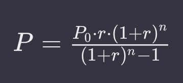
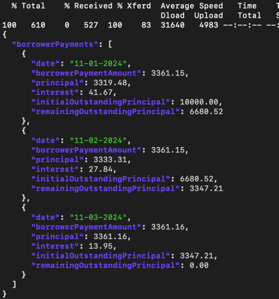
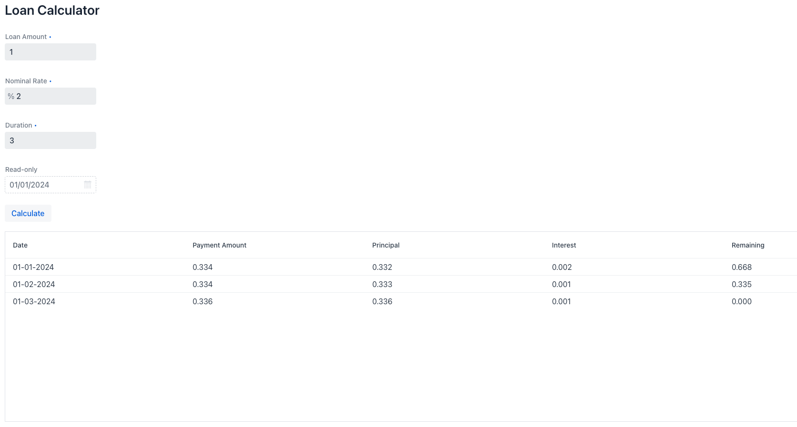

# Cool Bank Loan Calculator

## Description

This Loan Calculator is a plan generator, what informs borrowers about the final repayment schedule, we need to have
pre-calculated repayment plans throughout the
lifetime of a loan.

To be able to calculate a repayment plan, specific input parameters are necessary:

- duration (number of instalments in months)
- nominal rate (annual interest rate)
- loan amount (principal amount)
- date of disbursement/payout ("startDate")

The goal is to calculate a repayment plan for an annuity loan.

Formula to calculate monthly payment (annuity):



```
Where:
P = monthly payment (annuity),
P0 = loan amount (initial principal),
r = monthly interest rate (annual rate divided by 12),
n = total number of payments (loan term in months).
```

It is a simple Spring Boot Application with only one endpoint:

```
POST http://localhost:8080/generate-plan
```

with an Input Payload looks like this:

```json
{
  "loanAmount": "5000",
  "nominalRate": "5.0",
  "duration": 24,
  "startDate": "01-01-2024"
}
```

and response similar to:

```json
{
  "borrowerPayments": [
    {
      "borrowerPaymentAmount": "219.36",
      "date": "01-01-2024",
      "initialOutstandingPrincipal": "5000.00",
      "interest": "20.83",
      "principal": "198.53",
      "remainingOutstandingPrincipal": "4801.47"
    },
    {
      "borrowerPaymentAmount": "219.36",
      "date": "01-02-2024",
      "initialOutstandingPrincipal": "4801.47",
      "interest": "20.01",
      "principal": "199.35",
      "remainingOutstandingPrincipal": "4602.12"
    },
    ...
    {
      "borrowerPaymentAmount": "219.28",
      "date": "01-12-2025",
      "initialOutstandingPrincipal": "218.37",
      "interest": "0.91",
      "principal": "218.37",
      "remainingOutstandingPrincipal": "0"
    }
  ]
}
```

## How To:

### Dependencies

1. Java 17
2. Maven
3. Terminal
4. curl
5. jq

Here is used CURL, over other services like POSTMAN for several reasons.
It is available almost everywhere (at least Linux/MacOS), it has minimal dependencies, it is easy to start using just
from Terminal.

"jq" is just a pretty printer, the solution works without it, but with it it looks better.

It is assumed that MacOS is used as a host OS.

To install Maven:

```
brew install mvn
```

To install jq:

```
brew install jq
```

### Steps to run

1. Run the application: `mvn spring-boot:run`
2. Perform CURL call:

```
curl -X POST -H "Content-Type: application/json" -d '{"loanAmount": 10000, "nominalRate": 5.0, "duration": 3, "startDate": "11-01-2024"}' http://localhost:8081/generate-plan | jq
```

You should get output like:



### Vaadin UI

There is Vaadin UI which looks like this:


Once `CoolBankLoanCalculator` Spring Boot Application is up and running, UI is opened automatically on http://localhost:8081

### TESTS

Run unit-tests:

```
mvn clean test
```

### NOTES

There is a situation, after the calculation, divides and roundings, at the end, initial outstanding principal is not 0
and
principal amount does not exceed the initial outstanding principal amount.
In this case we have a positive reminder, which has to be taken into account as well, otherwise loan is not fully
repaid.
In this case this reminder is added to the latest payment to be made.

See `LoanCalculator.addReminderToTheLastPayment()` method for details.